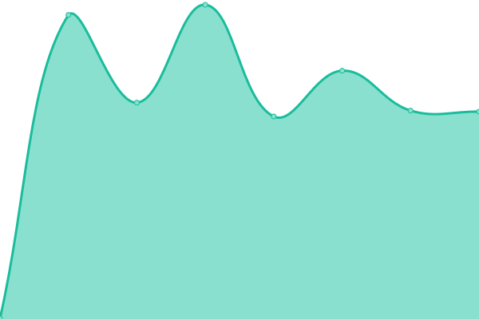
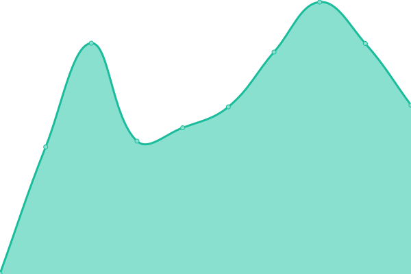

# [📈 Live Status](https://status.katys.cf): <!--live status--> **🟩 All systems operational**

This repository contains the open-source uptime monitor and status page for [server-KaTys](https://status.katys.cf), powered by [Upptime](https://github.com/upptime/upptime).

With [Upptime](https://upptime.js.org), you can get your own unlimited and free uptime monitor and status page, powered entirely by a GitHub repository. We use [Issues](https://github.com/server-KaTys/status/issues) as incident reports, [Actions](https://github.com/server-KaTys/status/actions) as uptime monitors, and [Pages](https://status.katys.cf) for the status page.

<!--start: status pages-->
<!-- This summary is generated by Upptime (https://github.com/upptime/upptime) -->
<!-- Do not edit this manually, your changes will be overwritten -->
<!-- prettier-ignore -->
| URL | Status | History | Response Time | Uptime |
| --- | ------ | ------- | ------------- | ------ |
|  [Portfolio @ Tiana Lemesle](https://tianalemesle.fr) | 🟩 Up | [portfolio-tiana-lemesle.yml](https://github.com/server-KaTys/status/commits/HEAD/history/portfolio-tiana-lemesle.yml) | 

 569ms
     
 | 

<a href="https://status.katys.cf/history/portfolio-tiana-lemesle">100.00%</a>
    

|  [Shields @ KaKi87](https://shields.kaki87.net) | 🟩 Up | [shields-ka-ki87.yml](https://github.com/server-KaTys/status/commits/HEAD/history/shields-ka-ki87.yml) | 

 602ms
     
 | 

<a href="https://status.katys.cf/history/shields-ka-ki87">100.00%</a>
    

|  [Gitea @ KaKi87](https://git.kaki87.net) | 🟩 Up | [gitea-ka-ki87.yml](https://github.com/server-KaTys/status/commits/HEAD/history/gitea-ka-ki87.yml) | 

 691ms
     
 | 

<a href="https://status.katys.cf/history/gitea-ka-ki87">100.00%</a>
    

|  [Play Search @ KaKi87](https://api.playsearch.kaki87.net) | 🟩 Up | [play-search-ka-ki87.yml](https://github.com/server-KaTys/status/commits/HEAD/history/play-search-ka-ki87.yml) | 

 539ms
     
 | 

<a href="https://status.katys.cf/history/play-search-ka-ki87">100.00%</a>
    

|  [Unrestrict @ KaKi87](https://unrestrict.kaki87.net/) | 🟩 Up | [unrestrict-ka-ki87.yml](https://github.com/server-KaTys/status/commits/HEAD/history/unrestrict-ka-ki87.yml) | 

 539ms
     
 | 

<a href="https://status.katys.cf/history/unrestrict-ka-ki87">100.00%</a>
    

|  [LibreSpeed @ KaKi87](https://speedtest.kaki87.net/) | 🟩 Up | [libre-speed-ka-ki87.yml](https://github.com/server-KaTys/status/commits/HEAD/history/libre-speed-ka-ki87.yml) | 

 569ms
     
 | 

<a href="https://status.katys.cf/history/libre-speed-ka-ki87">100.00%</a>
    

|  [General API @ KaKi87](https://api.kaki87.net) | 🟩 Up | [general-api-ka-ki87.yml](https://github.com/server-KaTys/status/commits/HEAD/history/general-api-ka-ki87.yml) | 

 519ms
     
 | 

<a href="https://status.katys.cf/history/general-api-ka-ki87">100.00%</a>
    

|  [CestLaGreve API @ KaKi87](https://cestlagreve.api.kaki87.net) | 🟩 Up | [cest-la-greve-api-ka-ki87.yml](https://github.com/server-KaTys/status/commits/HEAD/history/cest-la-greve-api-ka-ki87.yml) | 

 508ms
     
 | 

<a href="https://status.katys.cf/history/cest-la-greve-api-ka-ki87">100.00%</a>
    

|  [cv.vg dev API @ KaKi87](https://d.cv.vg) | 🟩 Up | [cv-vg-dev-api-ka-ki87.yml](https://github.com/server-KaTys/status/commits/HEAD/history/cv-vg-dev-api-ka-ki87.yml) | 

 1431ms
     
 | 

<a href="https://status.katys.cf/history/cv-vg-dev-api-ka-ki87">100.00%</a>
    

|  [Tolgee @ KaKi87](https://i18n.kaki87.net) | 🟩 Up | [tolgee-ka-ki87.yml](https://github.com/server-KaTys/status/commits/HEAD/history/tolgee-ka-ki87.yml) | 

 578ms
     
 | 

<a href="https://status.katys.cf/history/tolgee-ka-ki87">100.00%</a>
    

|  [Netdata](https://netdata.katys.cf) | 🟩 Up | [netdata.yml](https://github.com/server-KaTys/status/commits/HEAD/history/netdata.yml) | 

 858ms
     
 | 

<a href="https://status.katys.cf/history/netdata">100.00%</a>
    

|  [Glitchgit @ KaKi87](https://glitchgit.kaki87.net) | 🟩 Up | [glitchgit-ka-ki87.yml](https://github.com/server-KaTys/status/commits/HEAD/history/glitchgit-ka-ki87.yml) | 

 512ms
     
 | 

<a href="https://status.katys.cf/history/glitchgit-ka-ki87">100.00%</a>
    

|  [Apache](148.251.48.170) | 🟩 Up | [apache.yml](https://github.com/server-KaTys/status/commits/HEAD/history/apache.yml) | 

 95ms
     
 | 

<a href="https://status.katys.cf/history/apache">100.00%</a>
    

|  [Chat I (Matrix) @ KaKi87](https://chat.kaki87.net/_matrix/client/versions) | 🟩 Up | [chat-i-matrix-ka-ki87.yml](https://github.com/server-KaTys/status/commits/HEAD/history/chat-i-matrix-ka-ki87.yml) | 

 457ms
     
 | 

<a href="https://status.katys.cf/history/chat-i-matrix-ka-ki87">100.00%</a>
    

|  [Chat II (Fosscord) @ KaKi87](https://chat2.kaki87.net) | 🟩 Up | [chat-ii-fosscord-ka-ki87.yml](https://github.com/server-KaTys/status/commits/HEAD/history/chat-ii-fosscord-ka-ki87.yml) | 

 483ms
     
 | 

<a href="https://status.katys.cf/history/chat-ii-fosscord-ka-ki87">100.00%</a>
    

|  [Tauri update server @ KaKi87](https://tauri-updates.kaki87.net) | 🟩 Up | [tauri-update-server-ka-ki87.yml](https://github.com/server-KaTys/status/commits/HEAD/history/tauri-update-server-ka-ki87.yml) | 

 427ms
     
 | 

<a href="https://status.katys.cf/history/tauri-update-server-ka-ki87">100.00%</a>
    

<!--end: status pages-->

[**Visit our status website →**](https://status.katys.cf)

## 📄 License

- Powered by: [Upptime](https://github.com/upptime/upptime)
- Code: [MIT](./LICENSE) © [server-KaTys](https://status.katys.cf)
- Data in the `./history` directory: [Open Database License](https://opendatacommons.org/licenses/odbl/1-0/)
