# [📈 Live Status](https://status.katys.cf): <!--live status--> **🟧 Partial outage**

This repository contains the open-source uptime monitor and status page for [server-KaTys](https://status.katys.cf), powered by [Upptime](https://github.com/upptime/upptime).

With [Upptime](https://upptime.js.org), you can get your own unlimited and free uptime monitor and status page, powered entirely by a GitHub repository. We use [Issues](https://github.com/server-KaTys/status/issues) as incident reports, [Actions](https://github.com/server-KaTys/status/actions) as uptime monitors, and [Pages](https://status.katys.cf) for the status page.

<!--start: status pages-->
<!-- This summary is generated by Upptime (https://github.com/upptime/upptime) -->
<!-- Do not edit this manually, your changes will be overwritten -->
<!-- prettier-ignore -->
| URL | Status | History | Response Time | Uptime |
| --- | ------ | ------- | ------------- | ------ |
|  [[Tiana Lemesle] Portfolio](https://tianalemesle.fr) | 🟥 Down | [tiana-lemesle-portfolio.yml](https://github.com/server-KaTys/status/commits/HEAD/history/tiana-lemesle-portfolio.yml) | 

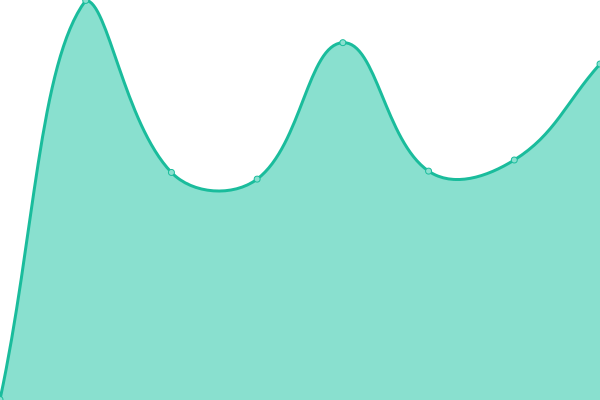 627ms
     
 | 

<a href="https://status.katys.eu.org/history/tiana-lemesle-portfolio">97.64%</a>
    

|  [[KaKi87] Shields](https://shields.kaki87.net) | 🟥 Down | [ka-ki87-shields.yml](https://github.com/server-KaTys/status/commits/HEAD/history/ka-ki87-shields.yml) | 

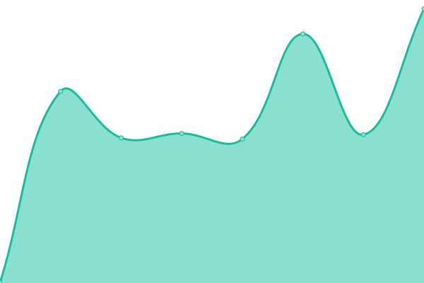 1519ms
     
 | 

<a href="https://status.katys.eu.org/history/ka-ki87-shields">97.71%</a>
    

|  [[KaKi87] Git](https://git.kaki87.net) | 🟥 Down | [ka-ki87-git.yml](https://github.com/server-KaTys/status/commits/HEAD/history/ka-ki87-git.yml) | 

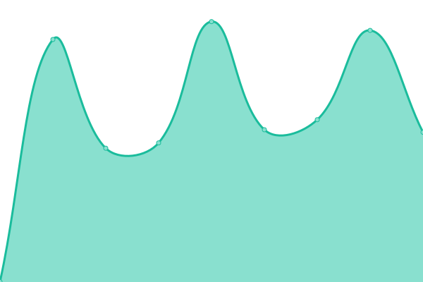 1289ms
     
 | 

<a href="https://status.katys.eu.org/history/ka-ki87-git">97.72%</a>
    

|  [[KaKi87] Git - SSH](git.kaki87.net) | 🟩 Up | [ka-ki87-git-ssh.yml](https://github.com/server-KaTys/status/commits/HEAD/history/ka-ki87-git-ssh.yml) | 

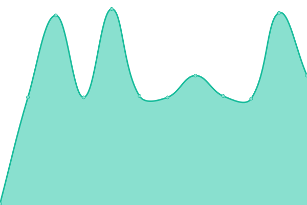 111ms
     
 | 

<a href="https://status.katys.eu.org/history/ka-ki87-git-ssh">100.00%</a>
    

|  [[KaKi87] Play Search](https://api.playsearch.kaki87.net) | 🟥 Down | [ka-ki87-play-search.yml](https://github.com/server-KaTys/status/commits/HEAD/history/ka-ki87-play-search.yml) | 

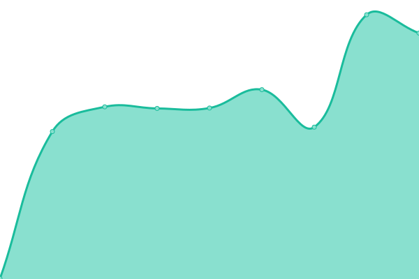 484ms
     
 | 

<a href="https://status.katys.eu.org/history/ka-ki87-play-search">97.72%</a>
    

|  [[KaKi87] General API](https://api.kaki87.net) | 🟥 Down | [ka-ki87-general-api.yml](https://github.com/server-KaTys/status/commits/HEAD/history/ka-ki87-general-api.yml) | 

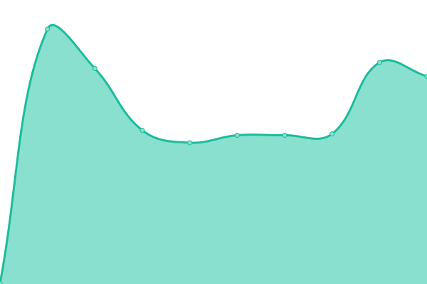 530ms
     
 | 

<a href="https://status.katys.eu.org/history/ka-ki87-general-api">97.73%</a>
    

|  [[KaKi87] CestLaGreve API](https://cestlagreve.api.kaki87.net) | 🟥 Down | [ka-ki87-cest-la-greve-api.yml](https://github.com/server-KaTys/status/commits/HEAD/history/ka-ki87-cest-la-greve-api.yml) | 

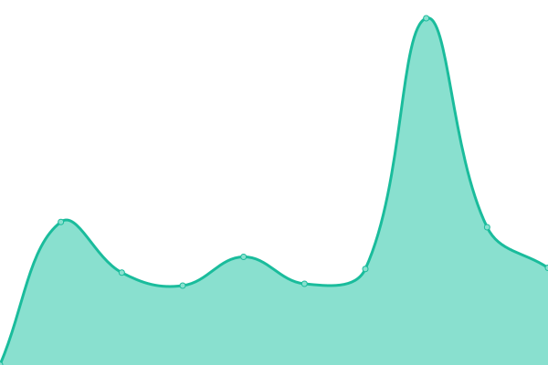 491ms
     
 | 

<a href="https://status.katys.eu.org/history/ka-ki87-cest-la-greve-api">97.74%</a>
    

|  [[cv.vg] Dev API](https://d.cv.vg) | 🟥 Down | [cv-vg-dev-api.yml](https://github.com/server-KaTys/status/commits/HEAD/history/cv-vg-dev-api.yml) | 

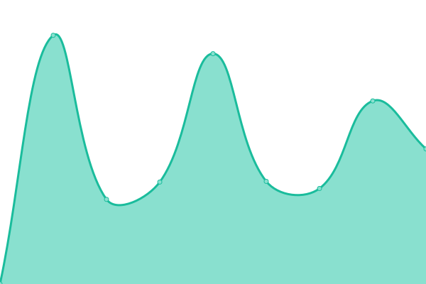 1444ms
     
 | 

<a href="https://status.katys.eu.org/history/cv-vg-dev-api">97.74%</a>
    

|  [Dashboard](https://dashboard.katys.eu.org) | 🟥 Down | [dashboard.yml](https://github.com/server-KaTys/status/commits/HEAD/history/dashboard.yml) | 

 1344ms
     
 | 

<a href="https://status.katys.eu.org/history/dashboard">97.75%</a>
    

|  [Apache](https://37.187.135.104) | 🟥 Down | [apache.yml](https://github.com/server-KaTys/status/commits/HEAD/history/apache.yml) | 

 332ms
     
 | 

<a href="https://status.katys.eu.org/history/apache">97.76%</a>
    

|  [[KaKi87] Chat (Matrix)](https://federationtester.matrix.org/api/report?server_name=chat.kaki87.net) | 🟥 Down | [ka-ki87-chat-matrix.yml](https://github.com/server-KaTys/status/commits/HEAD/history/ka-ki87-chat-matrix.yml) | 

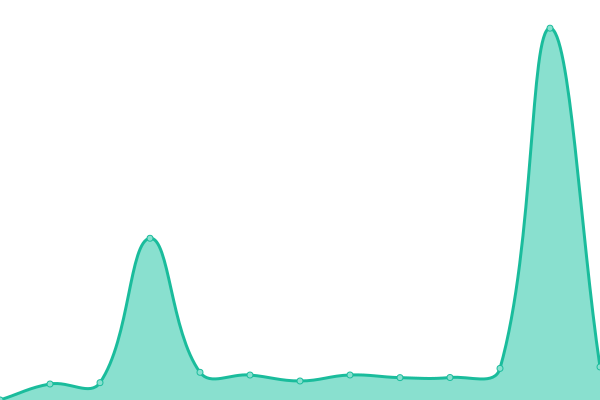 2820ms
     
 | 

<a href="https://status.katys.eu.org/history/ka-ki87-chat-matrix">97.79%</a>
    

|  [[KaKi87] Tauri updates](https://tauri-updates.kaki87.net) | 🟥 Down | [ka-ki87-tauri-updates.yml](https://github.com/server-KaTys/status/commits/HEAD/history/ka-ki87-tauri-updates.yml) | 

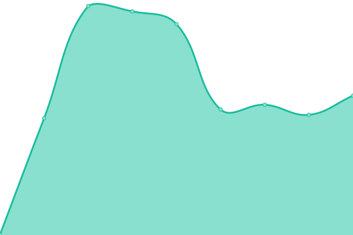 466ms
     
 | 

<a href="https://status.katys.eu.org/history/ka-ki87-tauri-updates">97.80%</a>
    

|  [[KaKi87] Analytics](https://analytics.kaki87.net) | 🟥 Down | [ka-ki87-analytics.yml](https://github.com/server-KaTys/status/commits/HEAD/history/ka-ki87-analytics.yml) | 

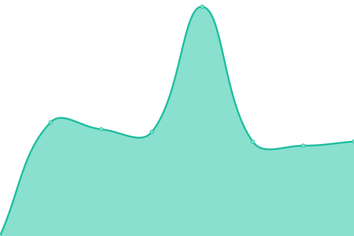 1180ms
     
 | 

<a href="https://status.katys.eu.org/history/ka-ki87-analytics">97.80%</a>
    

|  [[KaKi87] Subtitle Search](https://api.subtitle-search.kaki87.net) | 🟥 Down | [ka-ki87-subtitle-search.yml](https://github.com/server-KaTys/status/commits/HEAD/history/ka-ki87-subtitle-search.yml) | 

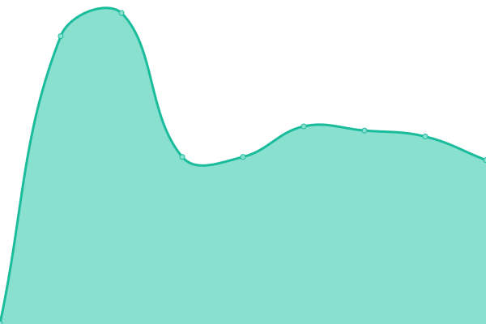 520ms
     
 | 

<a href="https://status.katys.eu.org/history/ka-ki87-subtitle-search">97.81%</a>
    

|  [[KaKi87] Invite Tracker - Discord bot](https://discord.com/api/guilds/1184503220060573746/widget.json) | 🟩 Up | [ka-ki87-invite-tracker-discord-bot.yml](https://github.com/server-KaTys/status/commits/HEAD/history/ka-ki87-invite-tracker-discord-bot.yml) | 

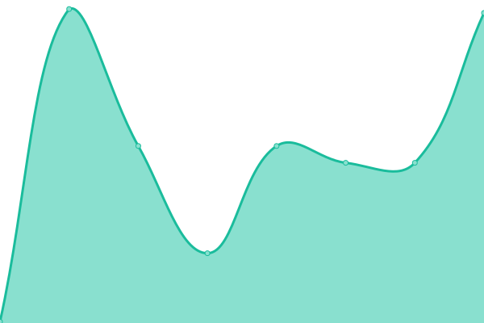 108ms
     
 | 

<a href="https://status.katys.eu.org/history/ka-ki87-invite-tracker-discord-bot">99.31%</a>
    

|  [KaKi87] Warez - Discord bot | 🟩 Up | [ka-ki87-warez-discord-bot.yml](https://github.com/server-KaTys/status/commits/HEAD/history/ka-ki87-warez-discord-bot.yml) | 

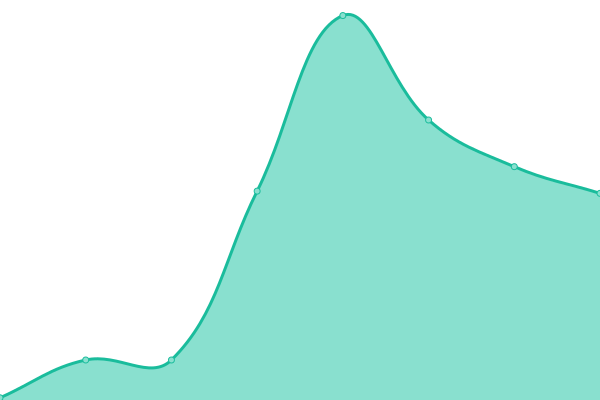 68ms
     
 | 

<a href="https://status.katys.eu.org/history/ka-ki87-warez-discord-bot">100.00%</a>
    

|  [[KaKi87] Warez Download API](https://wzdl.kaki87.net) | 🟥 Down | [ka-ki87-warez-download-api.yml](https://github.com/server-KaTys/status/commits/HEAD/history/ka-ki87-warez-download-api.yml) | 

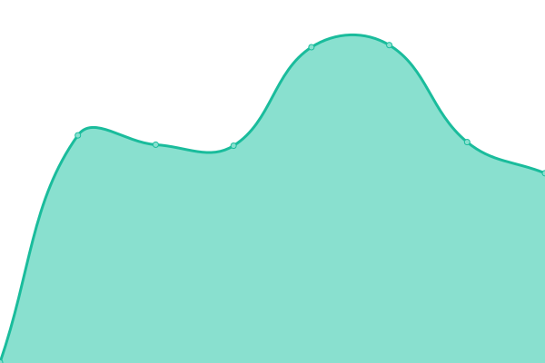 469ms
     
 | 

<a href="https://status.katys.eu.org/history/ka-ki87-warez-download-api">97.82%</a>
    

|  [KaKi87] Private service #2 - App | 🟥 Down | [ka-ki87-private-service-2-app.yml](https://github.com/server-KaTys/status/commits/HEAD/history/ka-ki87-private-service-2-app.yml) | 

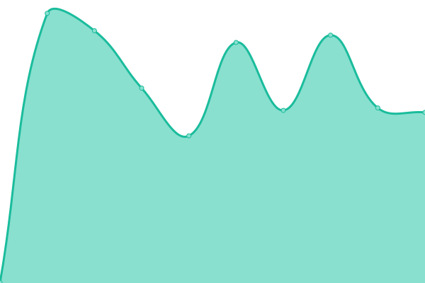 1296ms
     
 | 

<a href="https://status.katys.eu.org/history/ka-ki87-private-service-2-app">98.07%</a>
    

|  [[KaKi87] Downloads](https://dl.kaki87.net) | 🟥 Down | [ka-ki87-downloads.yml](https://github.com/server-KaTys/status/commits/HEAD/history/ka-ki87-downloads.yml) | 

 503ms
     
 | 

<a href="https://status.katys.eu.org/history/ka-ki87-downloads">98.07%</a>
    

|  [[KaKi87] Mail - SMTP (port 25)](kaki87.net) | 🟩 Up | [ka-ki87-mail-smtp-port-25.yml](https://github.com/server-KaTys/status/commits/HEAD/history/ka-ki87-mail-smtp-port-25.yml) | 

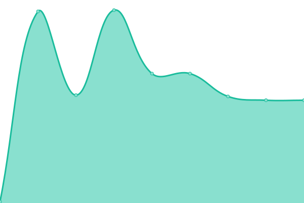 111ms
     
 | 

<a href="https://status.katys.eu.org/history/ka-ki87-mail-smtp-port-25">100.00%</a>
    

|  [[KaKi87] Mail - SMTP (port 465)](kaki87.net) | 🟩 Up | [ka-ki87-mail-smtp-port-465.yml](https://github.com/server-KaTys/status/commits/HEAD/history/ka-ki87-mail-smtp-port-465.yml) | 

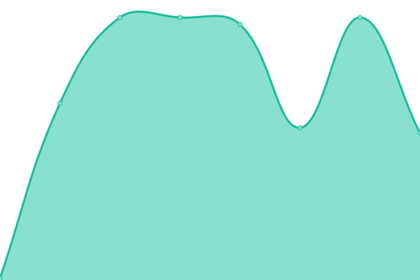 111ms
     
 | 

<a href="https://status.katys.eu.org/history/ka-ki87-mail-smtp-port-465">100.00%</a>
    

|  [[KaKi87] Mail - SMTP (port 587)](kaki87.net) | 🟩 Up | [ka-ki87-mail-smtp-port-587.yml](https://github.com/server-KaTys/status/commits/HEAD/history/ka-ki87-mail-smtp-port-587.yml) | 

 111ms
     
 | 

<a href="https://status.katys.eu.org/history/ka-ki87-mail-smtp-port-587">100.00%</a>
    

|  [[KaKi87] Mail - IMAP](kaki87.net) | 🟩 Up | [ka-ki87-mail-imap.yml](https://github.com/server-KaTys/status/commits/HEAD/history/ka-ki87-mail-imap.yml) | 

 112ms
     
 | 

<a href="https://status.katys.eu.org/history/ka-ki87-mail-imap">100.00%</a>
    

|  [[KaKi87] Changedetection](https://changedetection.kaki87.net) | 🟥 Down | [ka-ki87-changedetection.yml](https://github.com/server-KaTys/status/commits/HEAD/history/ka-ki87-changedetection.yml) | 

 597ms
     
 | 

<a href="https://status.katys.eu.org/history/ka-ki87-changedetection">98.08%</a>
    

<!--end: status pages-->

[**Visit our status website →**](https://status.katys.cf)

## 📄 License

- Powered by: [Upptime](https://github.com/upptime/upptime)
- Code: [MIT](./LICENSE) © [server-KaTys](https://status.katys.cf)
- Data in the `./history` directory: [Open Database License](https://opendatacommons.org/licenses/odbl/1-0/)
