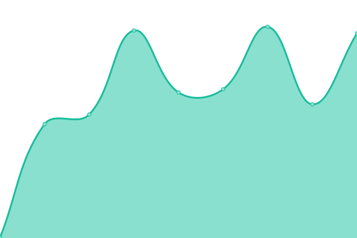

# [📈 Live Status](https://status.katys.cf): <!--live status--> **🟩 All systems operational**

This repository contains the open-source uptime monitor and status page for [server-KaTys](https://status.katys.cf), powered by [Upptime](https://github.com/upptime/upptime).

With [Upptime](https://upptime.js.org), you can get your own unlimited and free uptime monitor and status page, powered entirely by a GitHub repository. We use [Issues](https://github.com/server-KaTys/status/issues) as incident reports, [Actions](https://github.com/server-KaTys/status/actions) as uptime monitors, and [Pages](https://status.katys.cf) for the status page.

<!--start: status pages-->
<!-- This summary is generated by Upptime (https://github.com/upptime/upptime) -->
<!-- Do not edit this manually, your changes will be overwritten -->
<!-- prettier-ignore -->
| URL | Status | History | Response Time | Uptime |
| --- | ------ | ------- | ------------- | ------ |
|  [[Tiana Lemesle] Portfolio](https://tianalemesle.fr) | 🟩 Up | [tiana-lemesle-portfolio.yml](https://github.com/server-KaTys/status/commits/HEAD/history/tiana-lemesle-portfolio.yml) | 

 658ms
     
 | 

<a href="https://status.katys.eu.org/history/tiana-lemesle-portfolio">100.00%</a>
    

|  [[KaKi87] Shields](https://shields.kaki87.net) | 🟩 Up | [ka-ki87-shields.yml](https://github.com/server-KaTys/status/commits/HEAD/history/ka-ki87-shields.yml) | 

 766ms
     
 | 

<a href="https://status.katys.eu.org/history/ka-ki87-shields">100.00%</a>
    

|  [[KaKi87] Git](https://git.kaki87.net) | 🟩 Up | [ka-ki87-git.yml](https://github.com/server-KaTys/status/commits/HEAD/history/ka-ki87-git.yml) | 

 783ms
     
 | 

<a href="https://status.katys.eu.org/history/ka-ki87-git">100.00%</a>
    

|  [[KaKi87] Play Search](https://api.playsearch.kaki87.net) | 🟩 Up | [ka-ki87-play-search.yml](https://github.com/server-KaTys/status/commits/HEAD/history/ka-ki87-play-search.yml) | 

 692ms
     
 | 

<a href="https://status.katys.eu.org/history/ka-ki87-play-search">100.00%</a>
    

|  [[KaKi87] General API](https://api.kaki87.net) | 🟩 Up | [ka-ki87-general-api.yml](https://github.com/server-KaTys/status/commits/HEAD/history/ka-ki87-general-api.yml) | 

 622ms
     
 | 

<a href="https://status.katys.eu.org/history/ka-ki87-general-api">100.00%</a>
    

|  [[KaKi87] CestLaGreve API](https://cestlagreve.api.kaki87.net) | 🟩 Up | [ka-ki87-cest-la-greve-api.yml](https://github.com/server-KaTys/status/commits/HEAD/history/ka-ki87-cest-la-greve-api.yml) | 

 719ms
     
 | 

<a href="https://status.katys.eu.org/history/ka-ki87-cest-la-greve-api">100.00%</a>
    

|  [[cv.vg] Dev API](https://d.cv.vg) | 🟩 Up | [cv-vg-dev-api.yml](https://github.com/server-KaTys/status/commits/HEAD/history/cv-vg-dev-api.yml) | 

 1706ms
     
 | 

<a href="https://status.katys.eu.org/history/cv-vg-dev-api">100.00%</a>
    

|  [Netdata](https://netdata.katys.eu.org) | 🟩 Up | [netdata.yml](https://github.com/server-KaTys/status/commits/HEAD/history/netdata.yml) | 

 823ms
     
 | 

<a href="https://status.katys.eu.org/history/netdata">98.45%</a>
    

|  [[KaKi87] Sentry](https://sentry.kaki87.net) | 🟩 Up | [ka-ki87-sentry.yml](https://github.com/server-KaTys/status/commits/HEAD/history/ka-ki87-sentry.yml) | 

 884ms
     
 | 

<a href="https://status.katys.eu.org/history/ka-ki87-sentry">100.00%</a>
    

|  [Apache](https://37.187.135.104) | 🟩 Up | [apache.yml](https://github.com/server-KaTys/status/commits/HEAD/history/apache.yml) | 

 392ms
     
 | 

<a href="https://status.katys.eu.org/history/apache">98.61%</a>
    

|  [[KaKi87] Chat (Matrix)](https://chat.kaki87.net/_matrix/client/versions) | 🟩 Up | [ka-ki87-chat-matrix.yml](https://github.com/server-KaTys/status/commits/HEAD/history/ka-ki87-chat-matrix.yml) | 

 646ms
     
 | 

<a href="https://status.katys.eu.org/history/ka-ki87-chat-matrix">100.00%</a>
    

|  [[KaKi87] Tauri updates](https://tauri-updates.kaki87.net) | 🟩 Up | [ka-ki87-tauri-updates.yml](https://github.com/server-KaTys/status/commits/HEAD/history/ka-ki87-tauri-updates.yml) | 

 657ms
     
 | 

<a href="https://status.katys.eu.org/history/ka-ki87-tauri-updates">100.00%</a>
    

|  [[KaKi87] Analytics](https://analytics.kaki87.net) | 🟩 Up | [ka-ki87-analytics.yml](https://github.com/server-KaTys/status/commits/HEAD/history/ka-ki87-analytics.yml) | 

 882ms
     
 | 

<a href="https://status.katys.eu.org/history/ka-ki87-analytics">100.00%</a>
    

|  [[KaKi87] Subtitle Search](https://api.subtitle-search.kaki87.net) | 🟩 Up | [ka-ki87-subtitle-search.yml](https://github.com/server-KaTys/status/commits/HEAD/history/ka-ki87-subtitle-search.yml) | 

 636ms
     
 | 

<a href="https://status.katys.eu.org/history/ka-ki87-subtitle-search">100.00%</a>
    

|  [[KaKi87] Invite Tracker - Discord bot](https://discord.com/api/guilds/1184503220060573746/widget.json) | 🟩 Up | [ka-ki87-invite-tracker-discord-bot.yml](https://github.com/server-KaTys/status/commits/HEAD/history/ka-ki87-invite-tracker-discord-bot.yml) | 

 233ms
     
 | 

<a href="https://status.katys.eu.org/history/ka-ki87-invite-tracker-discord-bot">98.09%</a>
    

<!--end: status pages-->

[**Visit our status website →**](https://status.katys.cf)

## 📄 License

- Powered by: [Upptime](https://github.com/upptime/upptime)
- Code: [MIT](./LICENSE) © [server-KaTys](https://status.katys.cf)
- Data in the `./history` directory: [Open Database License](https://opendatacommons.org/licenses/odbl/1-0/)
