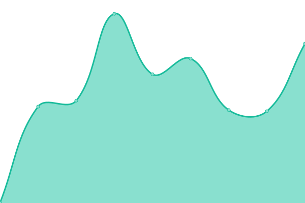
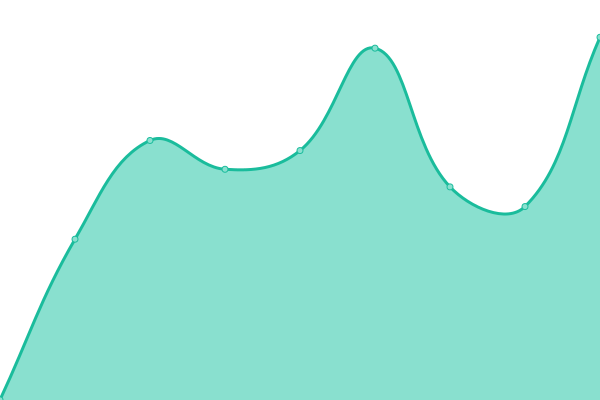
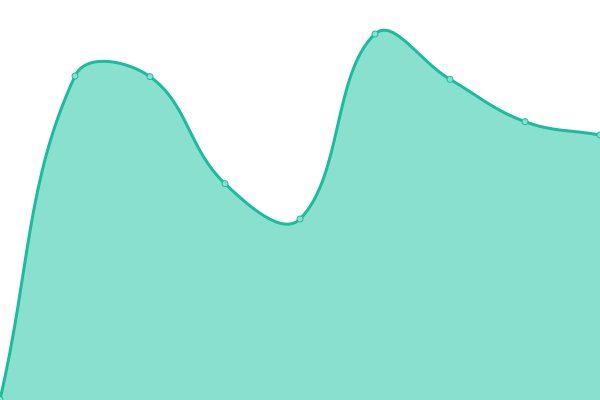
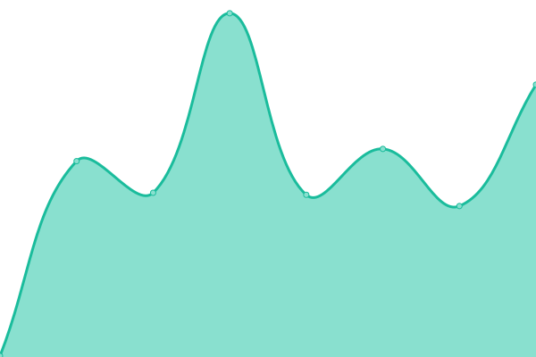
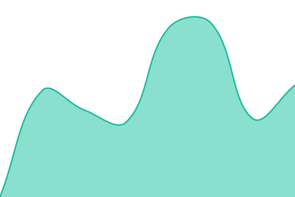
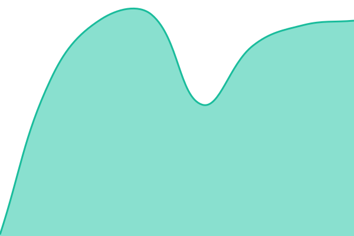

# [📈 Live Status](https://status.katys.cf): <!--live status--> **🟩 All systems operational**

This repository contains the open-source uptime monitor and status page for [server-KaTys](https://status.katys.cf), powered by [Upptime](https://github.com/upptime/upptime).

With [Upptime](https://upptime.js.org), you can get your own unlimited and free uptime monitor and status page, powered entirely by a GitHub repository. We use [Issues](https://github.com/server-KaTys/status/issues) as incident reports, [Actions](https://github.com/server-KaTys/status/actions) as uptime monitors, and [Pages](https://status.katys.cf) for the status page.

<!--start: status pages-->
<!-- This summary is generated by Upptime (https://github.com/upptime/upptime) -->
<!-- Do not edit this manually, your changes will be overwritten -->
<!-- prettier-ignore -->
| URL | Status | History | Response Time | Uptime |
| --- | ------ | ------- | ------------- | ------ |
|  [Portfolio](https://tianalemesle.fr) | 🟩 Up | [portfolio.yml](https://github.com/server-KaTys/status/commits/HEAD/history/portfolio.yml) | 

 1023ms
     
 | 

<a href="https://status.kaki87.net/history/portfolio">98.25%</a>
    

|  [Shields](https://shields.kaki87.net) | 🟩 Up | [shields.yml](https://github.com/server-KaTys/status/commits/HEAD/history/shields.yml) | 

 985ms
     
 | 

<a href="https://status.kaki87.net/history/shields">98.25%</a>
    

|  [Git](https://git.kaki87.net) | 🟩 Up | [git.yml](https://github.com/server-KaTys/status/commits/HEAD/history/git.yml) | 

 1186ms
     
 | 

<a href="https://status.kaki87.net/history/git">98.25%</a>
    

|  [Git - SSH](git.kaki87.net) | 🟩 Up | [git-ssh.yml](https://github.com/server-KaTys/status/commits/HEAD/history/git-ssh.yml) | 

 118ms
     
 | 

<a href="https://status.kaki87.net/history/git-ssh">98.25%</a>
    

|  [Play Search](https://api.playsearch.kaki87.net) | 🟩 Up | [play-search.yml](https://github.com/server-KaTys/status/commits/HEAD/history/play-search.yml) | 

 1017ms
     
 | 

<a href="https://status.kaki87.net/history/play-search">98.25%</a>
    

|  [General API](https://api.kaki87.net) | 🟩 Up | [general-api.yml](https://github.com/server-KaTys/status/commits/HEAD/history/general-api.yml) | 

 817ms
     
 | 

<a href="https://status.kaki87.net/history/general-api">98.25%</a>
    

|  [Dashboard](https://dashboard.kaki87.net) | 🟩 Up | [dashboard.yml](https://github.com/server-KaTys/status/commits/HEAD/history/dashboard.yml) | 

 957ms
     
 | 

<a href="https://status.kaki87.net/history/dashboard">98.25%</a>
    

|  [Caddy](kaki87.net) | 🟩 Up | [caddy.yml](https://github.com/server-KaTys/status/commits/HEAD/history/caddy.yml) | 

 119ms
     
 | 

<a href="https://status.kaki87.net/history/caddy">98.25%</a>
    

|  [Invite Tracker - Discord bot](https://discord.com/api/guilds/1184503220060573746/widget.json) | 🟩 Up | [invite-tracker-discord-bot.yml](https://github.com/server-KaTys/status/commits/HEAD/history/invite-tracker-discord-bot.yml) | 

 152ms
     
 | 

<a href="https://status.kaki87.net/history/invite-tracker-discord-bot">97.85%</a>
    

|  Warez - Discord bot | 🟩 Up | [warez-discord-bot.yml](https://github.com/server-KaTys/status/commits/HEAD/history/warez-discord-bot.yml) | 

 119ms
     
 | 

<a href="https://status.kaki87.net/history/warez-discord-bot">98.25%</a>
    

|  [Warez Download API](https://wzdl.kaki87.net) | 🟩 Up | [warez-download-api.yml](https://github.com/server-KaTys/status/commits/HEAD/history/warez-download-api.yml) | 

 720ms
     
 | 

<a href="https://status.kaki87.net/history/warez-download-api">98.25%</a>
    

|  Private service #2 - App | 🟩 Up | [private-service-2-app.yml](https://github.com/server-KaTys/status/commits/HEAD/history/private-service-2-app.yml) | 

 833ms
     
 | 

<a href="https://status.kaki87.net/history/private-service-2-app">98.25%</a>
    

|  [Downloads](https://dl.kaki87.net) | 🟩 Up | [downloads.yml](https://github.com/server-KaTys/status/commits/HEAD/history/downloads.yml) | 

 854ms
     
 | 

<a href="https://status.kaki87.net/history/downloads">98.25%</a>
    

|  [Mail - SMTP (port 25)](kaki87.net) | 🟩 Up | [mail-smtp-port-25.yml](https://github.com/server-KaTys/status/commits/HEAD/history/mail-smtp-port-25.yml) | 

 118ms
     
 | 

<a href="https://status.kaki87.net/history/mail-smtp-port-25">91.95%</a>
    

|  [Mail - SMTP (port 465)](kaki87.net) | 🟩 Up | [mail-smtp-port-465.yml](https://github.com/server-KaTys/status/commits/HEAD/history/mail-smtp-port-465.yml) | 

 118ms
     
 | 

<a href="https://status.kaki87.net/history/mail-smtp-port-465">98.25%</a>
    

|  [Mail - SMTP (port 587)](kaki87.net) | 🟩 Up | [mail-smtp-port-587.yml](https://github.com/server-KaTys/status/commits/HEAD/history/mail-smtp-port-587.yml) | 

 118ms
     
 | 

<a href="https://status.kaki87.net/history/mail-smtp-port-587">98.25%</a>
    

|  [Mail - IMAP (port 993)](kaki87.net) | 🟩 Up | [mail-imap-port-993.yml](https://github.com/server-KaTys/status/commits/HEAD/history/mail-imap-port-993.yml) | 

 118ms
     
 | 

<a href="https://status.kaki87.net/history/mail-imap-port-993">98.25%</a>
    

|  [Changedetection](https://changedetection.kaki87.net) | 🟩 Up | [changedetection.yml](https://github.com/server-KaTys/status/commits/HEAD/history/changedetection.yml) | 

 840ms
     
 | 

<a href="https://status.kaki87.net/history/changedetection">98.25%</a>
    

|  [Blog](https://blog.kaki87.net) | 🟩 Up | [blog.yml](https://github.com/server-KaTys/status/commits/HEAD/history/blog.yml) | 

 946ms
     
 | 

<a href="https://status.kaki87.net/history/blog">98.24%</a>
    

<!--end: status pages-->

[**Visit our status website →**](https://status.katys.cf)

## 📄 License

- Powered by: [Upptime](https://github.com/upptime/upptime)
- Code: [MIT](./LICENSE) © [server-KaTys](https://status.katys.cf)
- Data in the `./history` directory: [Open Database License](https://opendatacommons.org/licenses/odbl/1-0/)
